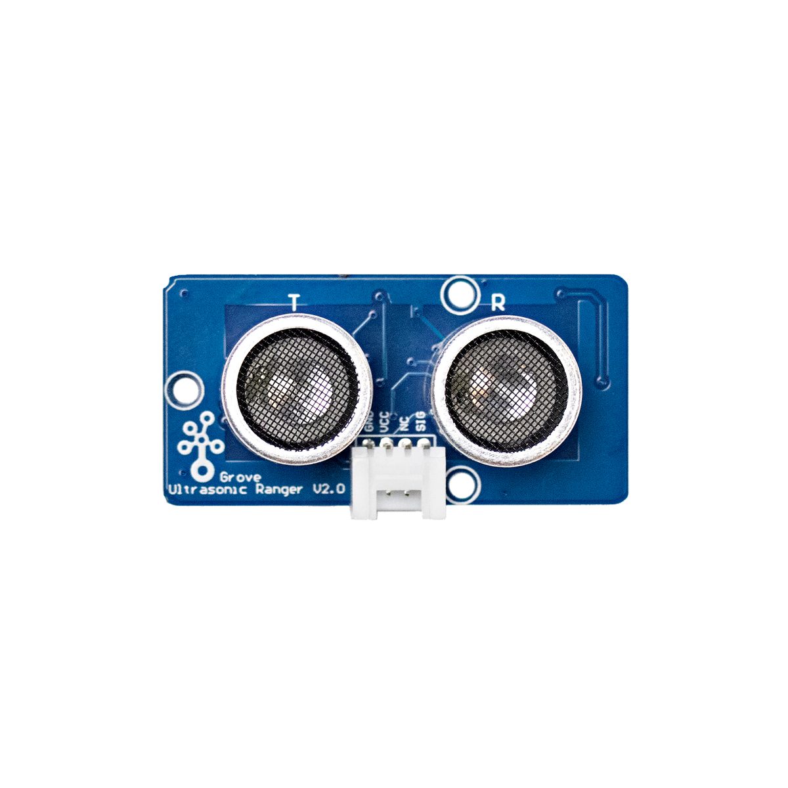

# Ultraschall-Entfernungssensor



## Beschreibung
Der Ultraschall-Entfernungssensor misst die Entfernung zwischen sich und einem vor ihm positionierten Gegenstand. Der Sensor strahlt eigene Ultraschall-Signale aus und analysiert das vom Objekt reflektierte Echo. So lassen sich Entfernungen zwischen 2cm und 350cm erfassen. Die Genauigkeit liegt hierbei bei  1cm.

Der Sensor kann direkt oder mithilfe des Grove Shields an einen Arduino oder Raspberry Pi angeschlossen werden. Der Sensor kommuniziert über ein digitales Signal.

Alle weiteren Hintergrundinformationen sowie ein Beispielaufbau und alle notwendigen Programmbibliotheken findet man über alle gängigen Suchmaschinen durch die Eingabe der genauen Komponentenbezeichnungen. Diese ist normalerweise direkt auf der Platine des Sensors markiert. Im Folgenden sind zwei Anleitungen zu den zwei gängigsten Sensortypen zusammengefasst.


## Beispiel

schau dir das Minimal-Beispiel an:

```c++:public/mks/parts/mks-SeeedStudio-Grove_Ultrasonic_Ranger/examples/Grove_Ultrasonic_Ranger_minimal/Grove_Ultrasonic_Ranger_minimal.ino
// look in the linked file.
```

<!-- infolist -->

@[youtube](https://www.youtube.com/watch?v=J8BHAVSdJe0&t=16s)

 

## Wichtige Hinweise:

- Es gibt zwei Arten von Ultraschall-Entfernungssensoren, die unterschiedlich verwendet werden müssen. Je nach Sensortyp kann der Anschluss und die Verwendung des Sensors leicht variieren.
- Der allgemeine Ultraschall-Entfernungssensor bezieht sich auf den Sensortyp HC-SR04. Man erkennt diesen an der roten Farbe und den vier folgenden Anschlüssen: VCC, Trig, Echo und GND.
- Der Grove Ultraschall-Entfernungssensor bezieht sich nur auf den speziellen Sensor von der Firma Seeed Studio. Man erkennt diesen an der blauen Platine und am Steckplatz mit den drei belegten Anschlüssen: GND, VCC und SIG. Der vierte Anschluss ist mit „NC“ beschriftet und bedeutet „not connected“ (deutsch: nicht belegt).
- Im Rahmen von _Make-Your-School-_Hackdays wird der im Bild gezeigte Grove Sensor von Seeed eingesetzt. Ihr findet die entsprechende Anleitung unter dem Link bei "Wichtige Links für die ersten Schritte". Für alle anderen Ultraschall-Entfernungssensoren (HC-SR04) könnt ihr die Projektbeispiele "Instructables - Arduino Ultrasonic Sensor" und "Arduino Project Hub - Blindenstock" als Einführung nutzen.

## Wichtige Links für die ersten Schritte:

- [Seeed Studio Wiki - Ultraschall Entfernungssensor](http://wiki.seeedstudio.com/Grove-Ultrasonic_Ranger/)

## Projektbeispiele:

- [Ultraschall-Entfernungssensor mit einem LCD-Bildschirm verbinden](https://simple-circuit.com/arduino-grove-ultrasonic-ranger-distance-meter-lcd/) 
- [Instructables – Arduino Ultrasonic Sensor](https://www.instructables.com/id/Arduino-Ultrasonic-Sensor/)
- [Arduino Project Hub – Blindenstock](https://create.arduino.cc/projecthub/hadi1234/arduino-blind-stick-19d865?ref=tag&ref_id=ultrasonic&offset=19)

## Weiterführende Hintergrundinformationen:

- [GPIO - Wikipedia Artikel](https://de.wikipedia.org/wiki/Allzweckeingabe/-ausgabe)
- [Schallgeschwindigkeit – Wikipedia Artikel](https://de.wikipedia.org/wiki/Schallgeschwindigkeit)
- [GitHub-Repository: Ultraschall-Entfernungssensor](https://github.com/MakeYourSchool/17-Ultraschall-Entfernungssensor)


